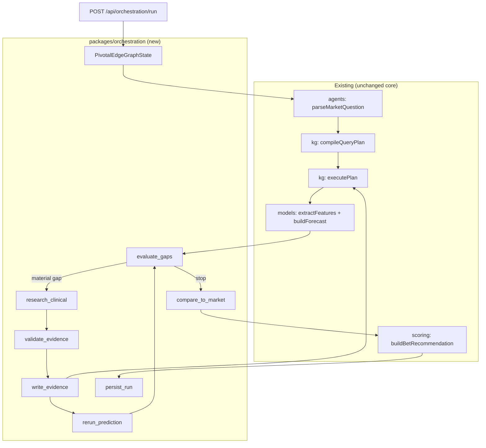
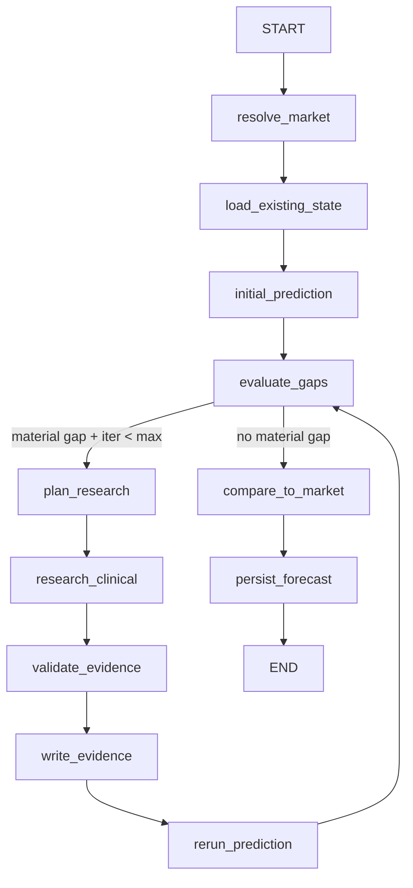

# LangGraph orchestration — end-to-end integration plan

**Status:** Active plan  
**Source spec:** [Notion — LangGraph Integration Spec](https://app.notion.com/p/3cabc227e87581bea89ae3ae501bd136)  
**Principle:** Integration/refactor, not rewrite. LangGraph orchestrates; `@pivotaledge/kg`, `@pivotaledge/models`, and `@pivotaledge/scoring` remain the analytical core.

---

## 1. Definition of success

PivotalEdge can run a **bounded evidence-acquisition loop** for one market:

1. Baseline forecast from existing KG (`P_initial`)
2. Ranked information gaps (contract-aware)
3. One or more targeted research fetches
4. Validated evidence written to canonical store
5. Rerun forecast (`P_enriched`)
6. Persist diff + audit trail
7. Compare enriched vs baseline on resolved outcomes (Brier / action quality)

LangGraph is **off by default**. Disabling orchestration must not change today’s deterministic pipeline.

---

## 2. Architectural decisions

| Decision | Choice | Rationale |
|----------|--------|-----------|
| Runtime | **TypeScript** in `packages/orchestration` | Monorepo is TS; reuse Zod schemas and existing packages |
| LangGraph usage | **Custom `StateGraph`** | Not a fork of generic ReAct/supervisor starters |
| Probability engine | **Unchanged** | ADR 0003 — LLM is evidence analyst only |
| KG write-back (MVP) | **Fixture/corpus JSON + run ledger** | ADR 0004 — Postgres deferred; in-memory graph is read-mostly today |
| Checkpoints (MVP) | **File-backed `MemorySaver`** under `data/orchestration/` | Postgres checkpointer when `packages/db` lands |
| First research branch | **Clinical/regulatory** (CT.gov + openFDA) | Matches `ENRICHMENT_PRIORITY.md` live-book gaps |
| Parallel agents | **Defer to Phase 4** | Prove single-loop ΔP value first |

---

## 3. Current-state integration map

Map Notion §5 interfaces to existing code. Adapters wrap these; LangGraph nodes do not reach into internals.

| Capability | Existing module | Entry function |
|------------|-----------------|----------------|
| Market discovery | `packages/agents` | `discoverBiotechMarkets()` |
| Market parse | `packages/agents` | `parseMarketQuestion()`, `heuristicParseMarketQuestion()` |
| Ambiguity review | `packages/agents` | `buildAmbiguityQueue()`, `requiresHumanReview()` |
| Query plan | `packages/kg` | `compileQueryPlan(question, opts)` |
| KG execute | `packages/kg` | `InMemoryKnowledgeGraphRepository.executePlan(plan)` |
| Graph load | `packages/kg` | `loadGraphFromProgramFixtures(fixtures)` |
| Missing evidence (heuristic) | `packages/kg/execute.ts` | `PrecedentBundle.missingHighValueEvidence` |
| Feature build | `packages/models` | `extractFeatures(bundle, question, opts)` |
| Forecast | `packages/models` | `buildForecast({ marketQuestion, precedentBundle, forecastCutoff })` |
| Bet recommendation | `packages/scoring` | `buildBetRecommendation({ ... })` |
| End-to-end dossier | `packages/workflows` | `evaluateOpportunity({ livePipeline: true })` |
| Batch enrich | `scripts/kg-enrich.ts` | CT.gov, openFDA, Orange Book, Open Targets |
| Program build | `packages/adapters` | `buildEnrichedProgramFixture()` |
| Trial extract | `packages/agents` | `extractTrialAssessment()` |
| Regulatory extract | `packages/agents` | `extractRegulatoryAssessment()` |
| Cutoff enforcement | `packages/schemas` | `isAvailableAtCutoff()`, `CutoffAuditSchema` |
| Live scoring | `scripts/kg-score-live.ts` | Polymarket → KG → forecast |
| Ops rationale | `packages/workflows` | `loadOpsMarketRationale()` |
| Calibration / backtest | `packages/evals` | `runProspectivePaperSample()`, holdout scripts |

### Gaps to build (no duplicate implementations)

| Gap | New module | Notes |
|-----|------------|-------|
| Orchestration graph | `packages/orchestration` | StateGraph, nodes, routing |
| Stable service façade | `packages/orchestration/src/services/` | Thin adapters over rows above |
| Contract-aware gap rank | `packages/orchestration/src/gaps/` | Uses `docs/ENRICHMENT_PRIORITY.md` matrix |
| Evidence write-back | `packages/orchestration/src/evidence/` | Validate → dedupe → append to corpus |
| Run persistence | `packages/orchestration/src/store/` | JSON run ledger + checkpoints |
| Enrichment A/B telemetry | `packages/evals/src/enrichment-ab.ts` | `P_initial` vs `P_enriched` |
| API routes | `apps/web/app/api/orchestration/` | run / status / diff / resume |
| Research Trace UI | `apps/web/app/components/research-trace.tsx` | Dossier panel |
| Schemas | `packages/schemas/src/orchestration.ts` | Run, gap, diff, trace |

---

## 4. Target architecture



**State rule:** Graph state holds IDs and compact metadata only. Documents, feature vectors, and bundles live in existing stores or run artifacts.

---

## 5. New package layout

```
packages/orchestration/
  package.json
  src/
    index.ts
    state.ts                 # PivotalEdgeGraphState (Annotation.Root)
    graph.ts                 # compileOrchestrationGraph()
    routing.ts               # shouldContinueResearch(), routeResearchBranch()
    config.ts                # MAX_RESEARCH_ITERATIONS, MIN_PROBABILITY_CHANGE, ...
    services/
      market.ts              # resolveMarketQuestion(marketId, cutoff)
      kg.ts                  # loadGraph, executePlan, reloadAfterWrite
      forecast.ts            # initial + enriched forecast helpers
      scoring.ts             # compareToMarket → BetRecommendation
    gaps/
      contract-matrix.ts     # eventType → required fields (from ENRICHMENT_PRIORITY)
      evaluate-gaps.ts       # rank ModelInformationGap[]
      plan-research.ts       # gap → ResearchTask[]
    nodes/
      resolve-market.ts
      load-existing-state.ts
      initial-prediction.ts
      evaluate-gaps.ts
      plan-research.ts
      research-clinical.ts   # Phase 2: only branch
      validate-evidence.ts
      write-evidence.ts
      rerun-prediction.ts
      compare-to-market.ts
      persist-forecast.ts
    evidence/
      validate.ts            # cutoff + schema + passage
      dedupe.ts
      contradictions.ts
      write.ts               # append to corpus fixture / vault
    store/
      run-ledger.ts          # data/orchestration/runs/{runId}.json
      checkpoints.ts         # MemorySaver + file persistence
```

Add to root `package.json`:

```json
"orchestration:run": "tsx scripts/orchestration-run.ts",
"orchestration:fixture": "tsx scripts/orchestration-run.ts --fixture synalphimab"
```

---

## 6. Schemas (`packages/schemas/src/orchestration.ts`)

```typescript
// Zod sketches — implement in Phase 1

ModelInformationGap {
  featureName: string
  currentValue: unknown | null
  missing: boolean
  featureImportance: number      // MVP: contract weight, not SHAP
  localSensitivity: number | null
  uncertainty: number | null
  potentiallyDecisionChanging: boolean
  researchQuestion: string
  sourcePriority: string[]       // e.g. ["clinicaltrials.gov", "openfda"]
}

ResearchTask {
  taskId: string
  gapFeature: string
  researchQuestion: string
  sourcePriority: string[]
  priorityScore: number
}

OrchestrationRun {
  runId: string
  marketId: string
  forecastCutoff: string
  status: "running" | "awaiting_review" | "completed" | "failed"
  researchIteration: number
  stopReason: string | null
  initialForecastId: string | null
  enrichedForecastId: string | null
  initialProbability: number | null
  enrichedProbability: number | null
  recommendation: BetRecommendation | null
  gapsBefore: ModelInformationGap[]
  researchTasks: ResearchTask[]
  newEvidenceIds: string[]
  contradictoryEvidenceIds: string[]
  featuresChanged: string[]
  checkpointPath: string | null
  createdAt: string
  completedAt: string | null
}

OrchestrationDiff {
  initialProbability: number
  finalProbability: number
  probabilityDelta: number
  evidenceAdded: number
  featuresChanged: string[]
  researchIterations: number
  stopReason: string
}
```

Extend `ModelCallSchema.purpose` with `"gap_eval" | "research_plan" | "evidence_extract"`.

---

## 7. Service adapter contract

LangGraph nodes call only these functions:

```typescript
// packages/orchestration/src/services/index.ts

resolveMarketQuestion(marketId: string, forecastCutoff: string)
  → { marketQuestion, predictionMarket, needsReview }

loadProgramSnapshot(marketQuestion, forecastCutoff)
  → { graph, repository, programFixturePaths }

executeKgPlan(marketQuestion, repository, forecastCutoff)
  → PrecedentBundle

computeInitialForecast(marketQuestion, bundle, forecastCutoff)
  → { forecast, features, modelRunId }

identifyInformationGaps(marketQuestion, bundle, features, forecast)
  → ModelInformationGap[]

planTargetedResearch(gaps, config)
  → ResearchTask[]

runClinicalResearch(task, marketQuestion, forecastCutoff)
  → EvidenceRecord[]   // raw candidates, not yet validated

validateEvidence(records, forecastCutoff)
  → { accepted: EvidenceRecord[], rejected: Rejection[] }

writeValidatedEvidence(records, runId, graphContext)
  → { newEvidenceIds, contradictoryEvidenceIds, fixturePath }

reloadGraphAfterWrite(fixturePaths)
  → KnowledgeGraphRepository

rerunForecast(marketQuestion, repository, forecastCutoff, priorForecastId)
  → { forecast, featuresChanged }

buildMarketComparison(marketQuestion, forecast, orderBooks, bundle)
  → BetRecommendation

persistOrchestrationRun(state)
  → OrchestrationRun

buildOrchestrationDiff(run)
  → OrchestrationDiff
```

Implement each as a thin wrapper. If logic already exists elsewhere, import it — do not fork.

---

## 8. Graph workflow (minimal loop — Phase 2)



### Stopping rules (configurable defaults)

```typescript
MAX_RESEARCH_ITERATIONS = 3
MIN_PROBABILITY_CHANGE = 0.02
MIN_HIGH_VALUE_GAP_SCORE = 0.25
MAX_PARALLEL_RESEARCH_TASKS = 4   // Phase 4 only
```

Stop when: no gap above threshold, ΔP below threshold, max iterations, or research returns zero validated evidence.

### Human interrupts (Phase 3)

Pause (`interrupt`) before `write_evidence` when:

- `needsReview` from market parser
- contradictory primary sources on high-sensitivity feature
- evidence lacks reliable `firstPublicAt`
- low-confidence regulatory extraction moves P by > `MIN_PROBABILITY_CHANGE`

---

## 9. Evidence write-back strategy (until Postgres)

**MVP path:** append validated assertions to the program fixture under `fixtures/corpus/live/` (same pattern as `kg:enrich`), then reload graph.

1. `write_evidence` merges into `ProgramFixture` using existing provenance shapes (`TemporalProvenance`).
2. Run ledger records `{ runId, fixturePath, assertionIds, parentChecksum }`.
3. `reloadGraphAfterWrite` calls `loadGraphFromProgramFixtures`.
4. Idempotency: dedupe by `(sourceUrl, checksum, predicate)`.

**Do not** mutate frozen snapshots (`opportunities/*-frozen.json`). Enriched runs produce new forecast IDs alongside baseline.

---

## 10. Gap evaluation (contract-first)

Phase 2 ranks gaps using **contract matrix** before model sensitivity:

| Source | Weight |
|--------|--------|
| `docs/ENRICHMENT_PRIORITY.md` §0 required-field matrix | Primary |
| `PrecedentBundle.missingHighValueEvidence` | Secondary |
| `assessRisks()` / policy clock context | Tertiary |
| Feature importance from model | Phase 4 (when S5b+ justifies) |

Priority function (MVP):

```
research_priority =
  contractRequiredWeight
  × (missing ? 1 : uncertainty)
  × expectedSourceAvailability
  × expectedDecisionImpact
```

Map gap keys to research actions:

| Gap key | Research action |
|---------|-----------------|
| `regulatory_application` | openFDA / Drugs@FDA search by drug name |
| `regulatory_acceptance_or_filing_guidance` | SEC/IR + regulatory extract (if source available) |
| `pdufa_or_target_action_date` | openFDA + curated clock facts |
| `trial_results` | CT.gov study + `extractTrialAssessment` |

Prefer deterministic API calls over LLM agents when adapter exists.

---

## 11. Phased delivery

### Phase 0 — Map & scaffold (1–2 days)

**Status:** ✅ Complete

**Goal:** Package exists; adapters stubbed; no graph yet.

- [x] Add `packages/orchestration` with `package.json`, tsconfig, vitest
- [x] Add `packages/schemas/src/orchestration.ts`
- [x] Implement service adapters (delegate to existing functions)
- [x] Add `data/orchestration/.gitkeep` and run-ledger types
- [x] Document env: `ORCHESTRATION_ENABLED=false` (default)

**Gate:** `pnpm typecheck` passes; adapter unit tests call real synalphimab fixtures.

**Files touched:** new package only + schema export in `packages/schemas/src/index.ts`.

---

### Phase 1 — Deterministic pipeline wrapper (2–3 days)

**Status:** ✅ Complete

**Goal:** `runDeterministicPipeline(marketId)` reproduces `evaluateOpportunity({ livePipeline: true })` through adapters.

- [x] `services/market.ts`, `services/kg.ts`, `services/forecast.ts`, `services/scoring.ts` (via port adapters)
- [x] `runDeterministicPipeline()` in `packages/orchestration/src/pipeline/deterministic-pipeline.ts`
- [x] CLI: `pnpm orchestration:fixture` (`scripts/orchestration-run.ts`)

**Gate:** Fingerprint match with `evaluateOpportunity` (same as existing test in `evaluate-opportunity.ts`).

**Test:** `tests/orchestration-pipeline.test.ts`

---

### Phase 2 — Minimal LangGraph loop (4–6 days)

**Status:** ✅ Complete

**Goal:** One complete enriched run on synalphimab fixture with mocked or live CT.gov fetch.

- [x] Add deps: `@langchain/langgraph`, `@langchain/core`
- [x] `state.ts`, `graph.ts`, `routing.ts`, nodes through `persist_forecast`
- [x] Single branch: `research_clinical`
- [x] File checkpoint via `MemorySaver` (thread_id = runId)
- [x] Persist `OrchestrationRun` + `OrchestrationDiff`

**Gate (Notion §19 subset):**

- [x] Pipeline runs with `ORCHESTRATION_ENABLED=false` unchanged
- [x] Graph completes one market end-to-end
- [x] Missing gap triggers research
- [x] Validated evidence recorded (in-memory writer; fixture corpus write in Phase 3)
- [x] `P_initial` and `P_enriched` both persisted
- [x] Historical replay rejects post-cutoff evidence (`orchestration-evidence.test.ts`)
- [ ] Crashed workflow resumes from checkpoint (Phase 3)

**Test:** `tests/orchestration-graph.test.ts`

**CLI:** `pnpm orchestration:fixture -- --enrich`

---

### Phase 3 — API + human review (2–3 days)

**Status:** ✅ Complete

**Goal:** Trigger and inspect runs from web/API.

| Route | Method | Behavior |
|-------|--------|----------|
| `/api/orchestration/run` | POST | `{ marketId, forecastCutoff?, resumeRunId? }` → `{ runId }` |
| `/api/orchestration/run/[runId]` | GET | Run status + trace |
| `/api/orchestration/run/[runId]/resume` | POST | Continue after human approval |
| `/api/orchestration/run/[runId]/diff` | GET | `OrchestrationDiff` JSON |
| `/api/orchestration/run/[runId]/evidence` | GET | New/contradictory evidence IDs |

- [x] `maxDuration` ≥ 120s on run route (match `/api/kg/run`)
- [x] Wire interrupt → `status: awaiting_review` via `human_review_gate` + `requireHumanReviewOnEvidence`

**Gate:** POST run from curl; GET diff shows ΔP and evidence count.

**Test:** `tests/orchestration-api.test.ts`

---

### Phase 4 — Contract-aware gaps + parallel branches (3–5 days)

**Status:** ✅ Complete

**Goal:** Live-book quality gap ranking; optional parallel fetches.

- [x] `gaps/contract-matrix.ts` from `ENRICHMENT_PRIORITY.md`
- [x] `compileQueryPlan` branches on `eventType` (platform P0 dependency)
- [x] Add branches: `research_regulatory`, `research_company` (fixture adapters; live sources Phase 5+)
- [x] Parallel tasks via LangGraph `Send` API where independent
- [x] Dedupe + contradiction preservation in `evidence/contradictions.ts`
- [x] Fail-closed research for `expectedFilingAt` (no synthetic filing date)

**Gate:** Intismeran-style submission surfaces `expectedFilingAt` gap; research does not invent filing date.

**Test:** `tests/orchestration-phase4.test.ts`

---

### Phase 5 — Enrichment A/B telemetry (2–3 days)

**Status:** ✅ Complete

**Goal:** Measure whether LangGraph helps.

- [x] `packages/evals/src/enrichment-ab.ts`
- [x] Extend prospective corpus rows with `{ pInitial, pEnriched, enrichmentRunId }`
- [x] Report: Brier/log-loss for initial vs enriched; action-quality delta
- [x] Script: `pnpm orchestration:ab-report`

**Gate:** Report runs on fixture corpus; documents incremental value (or null result).

**Test:** `tests/orchestration-enrichment-ab.test.ts`

**Fixture corpus:** `fixtures/orchestration/enrichment-ab-corpus.json` (synalphimab + synbetalib profiles)

---

### Phase 6 — UI Research Trace (2 days)

**Status:** ✅ Complete

**Goal:** Dossier shows before/after without exposing “LangGraph” as product concept.

- [x] `ResearchTracePanel` on `/dossier` and `/ops/market/[id]`
- [x] Display: baseline P, enriched P, market implied, gaps before, evidence added, iterations, stop reason
- [x] Link to `/api/orchestration/run/[runId]/diff`
- [x] `getLatestOrchestrationTraceForMarket()` loads most recent run from file store

**Gate:** UI acceptance test §19 — trace visible for completed run (when run artifacts exist).

**Files:** `apps/web/app/components/research-trace-panel.tsx`, `apps/web/app/dossier/page.tsx`

---

## 12. Prerequisites (parallel platform work)

These are **not** LangGraph blockers for Phase 2 fixture spike, but **are** blockers for live-book value:

| Item | Doc | Why |
|------|-----|-----|
| Contract-aware `compileQueryPlan` | `ENRICHMENT_PRIORITY.md` P0 | Gap ranking must match contract semantics |
| Required-field checklist on score | Same | Ops + orchestration share gap vocabulary |
| Quote vault freshness | ADR 0015 | `compare_to_market` needs executable asks |
| Postgres KG (optional for MVP) | ADR 0002, 0004 | Fixture write-back sufficient until scale |

---

## 13. Testing strategy

| Layer | What |
|-------|------|
| Unit | Gap rank, evidence validate, dedupe, cutoff reject |
| Integration | Full graph on synalphimab fixture with mocked CT.gov |
| Regression | `evaluateOpportunity` fingerprint unchanged when orchestration disabled |
| Leakage | Inject document with `firstPublicAt > cutoff` → must reject |
| Resume | Kill run mid-graph → resume from checkpoint → same final diff |
| A/B | Enrichment report on prospective corpus |

Add to CI: `tests/orchestration-*.test.ts` in existing `pnpm test`.

---

## 14. Observability & cost

- Log every node transition with `{ runId, node, durationMs }`
- Record `ModelCall` for LLM steps only (`gap_eval`, `research_plan`, `evidence_extract`)
- Token/cost cap per run via config (`MAX_RESEARCH_LLM_TOKENS`)
- Optional LangSmith: env `LANGCHAIN_TRACING_V2` (dev only)

---

## 15. Acceptance checklist (Notion §19 — full)

- [x] Existing KG/model prediction runs with LangGraph disabled
- [x] LangGraph executes one complete market forecast from existing data
- [x] Missing high-value feature triggers targeted research
- [x] New validated evidence written to canonical store
- [x] Duplicate evidence not duplicated
- [x] Contradictory evidence preserved, not overwritten
- [ ] New evidence changes only affected features (best-effort MVP: full re-extract)
- [x] Model reruns after enrichment
- [x] Initial and final probabilities persisted
- [x] Historical replay cannot see post-cutoff information
- [ ] Crashed workflow resumes from checkpoint (API resume works; cross-restart deferred)
- [x] Research terminates under bounded stopping rules
- [x] UI displays before/after research trace
- [x] Resolved forecast enters calibration evaluation

---

## 16. Implementation order (critical path)

```
Phase 0 scaffold
  → Phase 1 pipeline wrapper (prove adapters)
    → Phase 2 minimal graph (prove ΔP loop)
      → Phase 3 API
        → Phase 5 A/B (prove value)
          → Phase 4 parallel + contract gaps (scale)
            → Phase 6 UI
```

**Do not** start Phase 4 multi-agent branches until Phase 2 gate passes and Phase 5 shows non-zero enrichment signal on at least one fixture case.

---

## 17. First implementation PR scope

Smallest shippable increment:

1. `packages/orchestration` Phase 0 + 1
2. Schemas for `OrchestrationRun`, `OrchestrationDiff`
3. One test proving adapter fingerprint ≡ `evaluateOpportunity`
4. `docs/LANGGRAPH_INTEGRATION_PLAN.md` (this file)

Second PR: Phase 2 graph + fixture CLI.

---

## 18. Unresolved questions

1. **Live market entry point:** orchestrate from Polymarket `pm_{id}` directly, or only from seeded `fixtures/enrichment/seed-programs.json` slugs initially?  
   → **Recommend:** fixture first, then wire `kg-score-live` scored markets.

2. **Evidence store migration:** when `packages/db` lands, does write-back move from JSON corpus to Postgres in one cutover?  
   → **Recommend:** `EvidenceWriter` interface with `FixtureEvidenceWriter` then `PostgresEvidenceWriter`.

3. **LLM in research branch:** mandatory for Phase 2, or deterministic-only until extractors invoked?  
   → **Recommend:** deterministic fetch + existing extractors; LLM only when extractors require it.

---

## 19. Related docs

- [Notion LangGraph spec](https://app.notion.com/p/3cabc227e87581bea89ae3ae501bd136)
- `docs/ENRICHMENT_PRIORITY.md` — contract-aware gaps
- `docs/adr/0003-llm-evidence-analyst.md`
- `docs/adr/0004-inmemory-kg-repository.md`
- `docs/DEV_SEQUENCE.md` — S0–S9 complete; orchestration is post-MVP enrichment track
