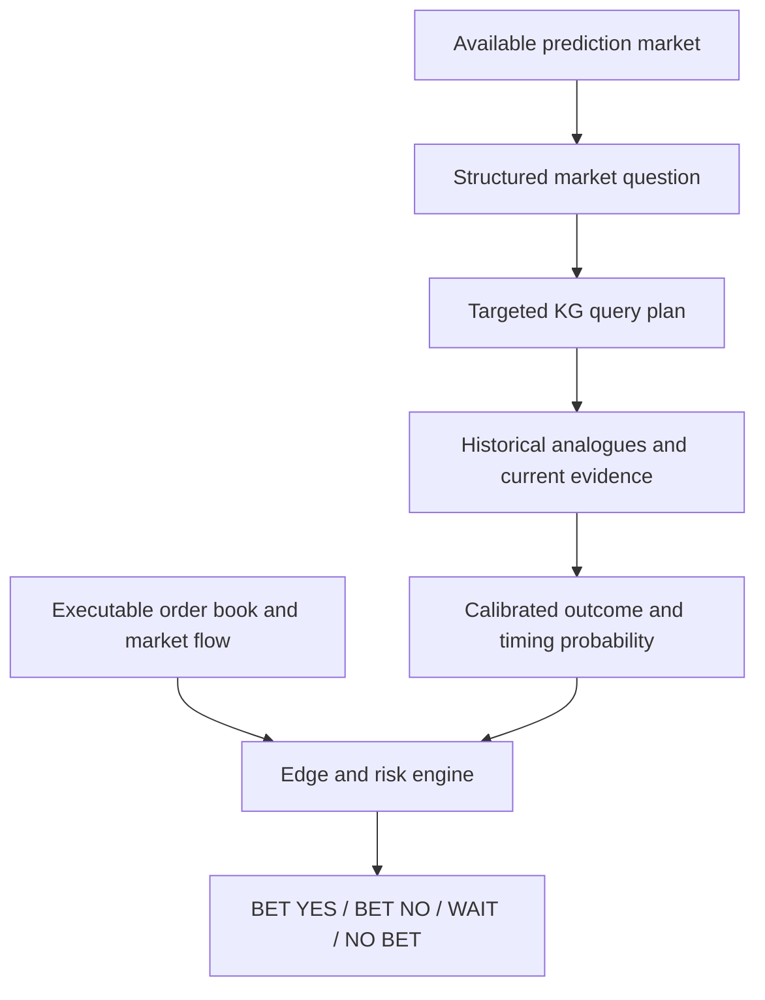
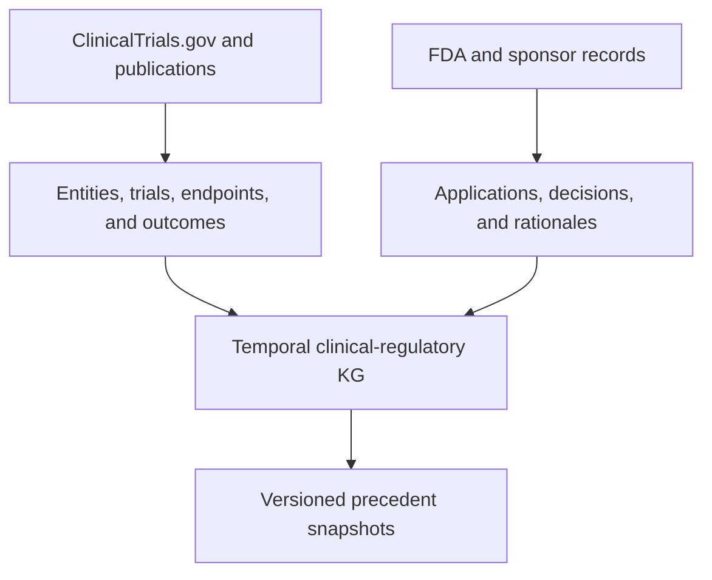

# PivotalEdge — Clinical-Regulatory Probability Engine — Cursor Implementation Spec

> **Source:** [Notion](https://app.notion.com/p/3c3bc227e87581adb4d3e9aa81bdfb5b)  
> **Synced:** 2026-08-21  
> **Parent:** Cross-Market Prediction Intelligence Platform Spec

> **Product decision:** Build a temporal clinical-regulatory knowledge graph from historical trials and FDA outcomes. Use each available prediction market to generate a targeted graph query, calculate an independent probability, compare it with the executable price, and return an explicit betting action. Historical FDA decisions and clinical-trial outcomes—not prediction-market history—form the principal training corpus.

**Name:** PivotalEdge  
**Descriptor:** Clinical-Regulatory Probability Intelligence  
**One-line proposition:** PivotalEdge turns available drug-related prediction markets into structured questions, queries a temporal knowledge graph of historical clinical trials and FDA decisions, and returns **BET YES, BET NO, WAIT, or NO BET** with a maximum price and stake.

---

## 1. Product thesis

Prediction markets covering drug approvals and clinical readouts are likely too sparse to train a scientifically credible outcome model. The larger and better-grounded corpus consists of historical development programs linking:

```
Drug → Indication → Trial design → Trial outcome → Submission → FDA decision
```

PivotalEdge will use OpenAI models to resolve entities, retrieve comparable programs, and extract structured evidence from scientific and regulatory documents. Deterministic statistical models will calculate and calibrate probabilities. Polymarket supplies the current market price, liquidity, transaction costs, and eventual opportunity to execute.

**The LLM is an evidence analyst, not the probability oracle.**

### Product boundary

**In scope**

- Temporal clinical-regulatory knowledge graph
- Retrospective clinical-trial and FDA-decision corpus
- Market-triggered knowledge-graph query planning
- Prospective FDA approval and pivotal-trial forecasts
- Approval-by-deadline decomposition
- Polymarket discovery and executable order-book comparison
- Cited evidence dossiers and analogue explanations
- Historical backtesting and prospective paper trading
- Explicit **BET YES / BET NO / WAIT / NO BET** recommendations
- Maximum entry price, recommendation expiry, invalidators, and conservative stake

**Out of scope for MVP**

- Autonomous live trading
- Material nonpublic information
- Medical advice
- Uncited LLM probability judgments
- Broad political or sports prediction markets
- Commercial data requiring licenses
- Neo4j or a graph database before relational joins prove inadequate

---

## 2. Primary users and jobs

### Initial user

A biotech investor or scientifically sophisticated trader asks:

> Which active drug-related prediction markets materially disagree with a historically calibrated clinical-regulatory estimate, and why?

### Core jobs

1. Discover active, resolvable biotechnology markets.
2. Map each market to the correct drug, sponsor, indication, submission, deadline, and underlying trials.
3. Reconstruct evidence that existed as of a specified date.
4. Estimate component and composite probabilities.
5. Compare the conservative estimate with executable bid/ask prices.
6. Rank opportunities by net edge, confidence, liquidity, and resolution time.
7. Explain the judgment with exact source passages and comparable FDA precedents.
8. Track every forecast to resolution and recalibrate the system.

---

## 3. Non-negotiable methodological rules

- Every historical feature must be available **before** the prediction timestamp.
- Preserve original documents, retrieval timestamps, checksums, and document versions.
- Separate sourced facts, extracted observations, calculated metrics, model inferences, and user judgments.
- Never treat a displayed midpoint as an executable price.
- Never train on Polymarket resolution outcomes as the primary clinical model.
- Use market prices as a comparison feature and optional ensemble prior, not as ground truth.
- Use chronological validation; random train/test splitting is prohibited.
- The same asset, indication, sponsor, or closely related program must not leak across folds.
- Every probability must include calibration status, interval, and model version.
- Every trade signal must include resolution-language risk and liquidity constraints.

---

## 4. System architecture

### Required operating loop



### Knowledge-graph construction loop



### Services

| Service         | Responsibility                                                    | MVP technology                            |
| --------------- | ----------------------------------------------------------------- | ----------------------------------------- |
| Web application | Portfolio, dossier, evidence, backtest, and monitoring UI         | Next.js, TypeScript, Tailwind, shadcn/ui  |
| API             | Typed access to programs, forecasts, markets, and evidence        | Next.js route handlers or FastAPI         |
| Workers         | Source ingestion, extraction, document parsing, and forecast jobs | Python                                    |
| Database        | Canonical entities, temporal evidence, forecasts, and outcomes    | PostgreSQL/Supabase with pgvector         |
| Object store    | Immutable raw files and parsed representations                    | Supabase Storage or S3-compatible storage |
| Models          | Extraction, retrieval, probability, timing, and calibration       | OpenAI API plus Python statistical stack  |

---

## 5. Market-triggered knowledge-graph query specification

See Notion source for full TypeScript schemas:

- `MarketQuestion`
- `KnowledgeGraphQueryPlan`
- `PrecedentBundle`
- Query orchestration steps 1–12

---

## 6. Source adapters

### Priority 1

- ClinicalTrials.gov API
- Drugs@FDA
- openFDA
- PubMed and Europe PMC
- SEC EDGAR
- Polymarket Gamma API
- Polymarket CLOB

### Priority 2

- FDA advisory-committee materials
- DailyMed, Open Targets, ChEMBL, DrugCentral, PubChem, Crossref
- Company IR feeds, conference abstracts

---

## 7–15. Domain, temporal evidence, OpenAI, features, models, markets, UI, API

Full detail in Notion. Canonical entities include `DrugAsset`, `ClinicalProgram`, `ClinicalTrial`, `RegulatoryApplication`, `Forecast`, `PredictionMarket`, `OpportunitySignal`, etc.

Terminal betting output: `BetRecommendation` with `BET_YES | BET_NO | WAIT | NO_BET`.

---

## 16. Repository structure

```
/apps/web
/apps/worker
/packages/db
/packages/schemas
/packages/adapters
/packages/agents
/packages/features
/packages/models
/packages/scoring
/packages/workflows
/packages/evals
/fixtures
/docs/adr
```

---

## 18. Cursor implementation phases

| Phase | Focus                               |
| ----- | ----------------------------------- |
| **0** | Foundation and contracts (current)  |
| 1     | Market discovery and entity mapping |
| 2     | Evidence foundation                 |
| 3     | Structured extraction               |
| 4     | Temporal clinical-regulatory KG     |
| 5     | Probability and timing models       |
| 6     | Edge engine and dashboard           |
| 7     | Retrospective market comparison     |
| 8     | Prospective paper trading           |

---

## 20. First Cursor-agent instruction (Phase 0)

Implement only: monorepo foundation, shared schemas, temporal provenance, model-call/job records, env validation, lint/format/typecheck/test/CI, fixture loader, synthetic fixtures, ADRs.

**Stop after Phase 0. Do not begin Phase 1. Do not add Neo4j.**

---

## 22. Decision record

**Selected name:** PivotalEdge  
**Strategic decision:** Train on historical trials and regulatory decisions. Use prediction markets for comparison/execution only.  
**Terminal objective:** Inform when to bet, on which side, at what max price, with capped stake and invalidators.  
**Status:** Implementation-ready draft (revised 2026-08-21).
